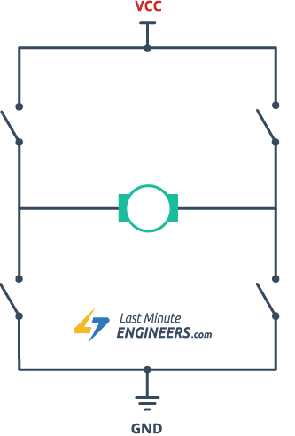
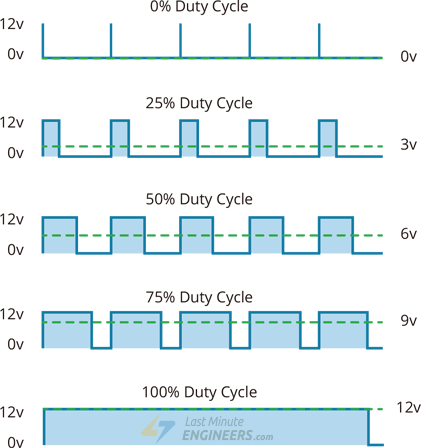
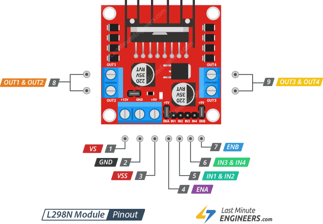
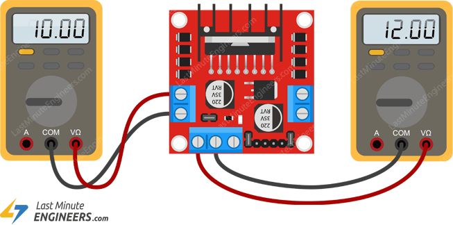

## Módulo L298N

**Controlando a direção com uma ponte H**

Uma ponte H é um circuito especial com quatro interruptores eletrónicos dispostos em forma de «H», com o motor no meio.

Ao ligar e desligar esses interruptores numa ordem específica, pode fazer com que a eletricidade flua através do motor numa direção ou na direção oposta. Este truque inteligente permite controlar a direção em que o motor gira sem ter de inverter fisicamente os fios.



**Controlando a velocidade com PWM**

Quando uma tensão fixa é aplicada a um motor DC, ele gira a uma velocidade fixa. Se quiser alterar a velocidade, é necessário ajustar a tensão. Uma tensão mais alta faz o motor girar mais rápido, enquanto uma tensão mais baixa o torna mais lento.

No entanto, alterar fisicamente a tensão o tempo todo não é muito prático. É aí que entra o PWM, ou modulação por largura de impulso.

O PWM é uma forma inteligente de controlar a quantidade média de energia enviada ao motor. Em vez de enviar uma tensão fixa, o PWM liga e desliga rapidamente a tensão em impulsos muito rápidos.

A «largura» de cada impulso ligado, também chamada de ciclo de trabalho, determina por quanto tempo a tensão fica «ligada» durante cada ciclo.



**Chip controlador de motor L298N**

No centro do módulo encontra-se um grande chip preto com um dissipador de calor robusto – o L298N.

Trata-se de um controlador de ponte H dupla de alta tensão e alta corrente, projetado principalmente para controlar cargas indutivas, como motores DC, motores de passo, relés e solenóides. Ele funciona como um amplificador de corrente, o que significa que recebe os sinais de controle de baixa corrente do arduino e os aumenta para os níveis mais altos de corrente e tensão necessários para o funcionamento dos motores.
Módulo controlador de motor L298N IC

Na sua essência, o L298N tem dois circuitos de ponte H separados. 

**Potência**

O L298N é bastante flexível quando se trata de alimentação. Ele pode funcionar com uma ampla gama de tensões, de 5 V a 46 V, e pode fornecer até 2 A de corrente contínua por canal, o que significa que pode lidar com tudo, desde pequenos motores para hobby até motores maiores e mais potentes.

**Proteção térmica**

O L298N também inclui proteção térmica integrada. Isto significa que, se o chip ficar muito quente — talvez porque um motor está a consumir muita corrente ou o chip não está a ser bem arrefecido —, o L298N desligará automaticamente as suas saídas temporariamente para evitar danos. Assim que o chip arrefecer até uma temperatura segura, ele volta a funcionar automaticamente.




**O módulo L298N tem 11 pinos no total.**

**Pinos de alimentação**

Existem dois pinos de entrada de alimentação no módulo L298N: VS e VSS.

VS é a entrada de alimentação principal para os motores. Em muitos módulos, este pino está identificado como +12V, mas na verdade pode suportar uma ampla gama de tensões DC, de 5V a 46V. No entanto, é importante compreender que a tensão que os motores recebem será um pouco inferior à que é fornecida ao pino VS. Isto porque os transístores internos da ponte H dentro do L298N causam uma queda de tensão de cerca de 2V. 

VSS é a entrada de alimentação para o circuito lógico interno do chip. Este circuito lógico precisa de 5 V estáveis para funcionar. Pode fornecer estes 5 V de duas maneiras. Uma opção é ligar uma fonte de alimentação externa de 5 V diretamente ao pino VSS. A outra opção é usar o regulador de tensão de 5 V integrado, que recebe energia da alimentação do motor (VS) e fornece automaticamente 5 V aos circuitos lógicos. Quando utiliza o regulador integrado, não precisa de ligar nada ao pino VSS. 

O pino GND é a ligação de terra comum para o módulo. Tanto a fonte de alimentação do motor como o Arduino devem partilhar uma terra comum através deste pino.

**Pinos de saída do motor**

Estes são os pinos onde você realmente conecta os seus motores DC.

Os pinos OUT1 e OUT2 conectam-se ao seu primeiro motor (motor A), enquanto os pinos OUT3 e OUT4 conectam-se ao seu segundo motor (motor B). Pode ligar qualquer motor DC que funcione entre 5 e 46 volts a estes pinos.

**Pinos de controlo de direção**

Estes pinos controlam a direção de rotação dos motores, ligando e desligando os interruptores internos da ponte H.

O chip tem dois pinos de controlo de direção para cada motor. Os pinos IN1 e IN2 controlam a direção de rotação do motor A, enquanto os pinos IN3 e IN4 controlam a direção de rotação do motor B.

Ao definir diferentes combinações de sinais HIGH ou LOW nestes pinos, pode fazer com que os motores girem para a frente, para trás ou parem. O gráfico abaixo mostra exatamente como isso funciona:

Input1	Input2	Spinning Direction
Low(0)	Low(0)	Motor OFF
High(1)	Low(0)	Forward
Low(0)	High(1)	Backward
High(1)	High(1)	Motor OFF

**Pinos de controlo de velocidade**

Os pinos ENA e ENB controlam a velocidade de rotação dos motores.

Na verdade, estes pinos podem funcionar como simples interruptores liga/desliga. Quando se coloca um deles em HIGH, o motor correspondente é ativado e gira a toda a velocidade. Quando se coloca em LOW, o motor é completamente desativado e não gira.

Mas esses pinos podem fazer mais do que apenas ligar ou desligar os motores. Ao enviar um sinal PWM (modulação por largura de impulso) para ENA ou ENB, você pode realmente controlar a velocidade de cada motor.

O PWM funciona ligando e desligando o motor muito rapidamente — muitas vezes por segundo. A velocidade depende de quanto tempo o motor permanece ligado durante cada ciclo (`duty cycle`). Se o sinal permanecer ligado na maior parte do tempo, o motor gira mais rápido. Se ficar ligado por pouco tempo, o motor gira mais devagar.

O módulo L298N geralmente vem com jumpers colocados nos pinos ENA e ENB, que os conectam diretamente a 5V. Isso faz com que os motores girem em velocidade máxima por padrão. Se quiser controlar a velocidade dos seus motores através do Arduino, precisará remover esses jumpers e conectar os pinos ENA e ENB aos pinos habilitados para PWM do Arduino.

**Queda de tensão do L298N**

Talvez saiba que quando um transístor é ligado ou fica num estado «saturado», permitindo que a corrente flua através dele, há sempre uma pequena quantidade de tensão que se perde ao longo dele. O L298N usa transístores de junção bipolar (BJTs) dentro do seu circuito H-Bridge, que são conhecidos por terem uma queda de tensão perceptível.




De acordo com a ficha técnica, a queda de tensão no L298N pode variar entre cerca de 1,8 V e 3,2 V quando a corrente é de cerca de 1 ampere, e pode chegar a quase 5 V quando a corrente atinge 2 amperes.
Referência da ficha técnica da queda de tensão do L298N

Portanto, como regra geral, pode-se assumir uma queda de tensão de cerca de 2 V em uso típico.

O que esta queda de tensão significa para os seus motores é que, se fornecer 12 V à entrada de alimentação do motor (VS), os seus motores receberão apenas aproximadamente 10 V de potência. É por isso que os seus motores de 12 V CC podem não funcionar à velocidade máxima quando alimentados através do L298N com exatamente 12 V.

Para garantir que o seu motor funcione à velocidade máxima, deve fornecer uma tensão à fonte de alimentação do motor que seja cerca de 2 V superior à tensão real de que o seu motor necessita. Por exemplo, se estiver a utilizar um motor de 5 V, terá de fornecer cerca de 7 V ao terminal de alimentação do motor. Da mesma forma, se tiver motores de 12 V, a tensão de alimentação do motor deve ser de cerca de 14 V para ajudá-los a atingir a velocidade máxima.

**Regulador de 5 V integrado e jumper**

O módulo controlador de motor L298N vem com um regulador de tensão 78M05 integrado. O objetivo deste regulador é obter energia da entrada de alimentação do motor (conectada ao pino VS) e convertê-la em 5 V estáveis. Esses 5 V são então usados para alimentar o circuito lógico interno do chip L298N, o que significa que não é necessário conectar uma fonte de alimentação de 5 V separada ao pino VSS.

Há um pequeno jumper no módulo que permite ativar ou desativar este regulador.

Quando o jumper está no lugar, o regulador de 5V é ativado. Neste modo, o regulador de 5V alimenta automaticamente o circuito lógico interno do chip usando a entrada de alimentação do motor, e o pino VSS torna-se uma saída de 5V. Esta saída pode fornecer até 0,5 amperes de corrente, o que geralmente é suficiente para alimentar um ESP32 ou outros pequenos componentes eletrónicos.

No entanto, é importante observar que o regulador de 5 V integrado não foi projetado para lidar com tensões de entrada superiores a 12 V. Portanto, você só deve usar esse recurso se a alimentação do motor for inferior a 12 V. Se a alimentação do motor for superior a 12 V, você deve remover o jumper para evitar danos ao regulador de 5 V integrado.

Codigo de teste

```cpp
// Motor A connections
int enA = 5;  // ENA pin, pwm capable pin
int in1 = 6;  // IN1 pin, any digital pin
int in2 = 7;  // IN2 pin, any digital pin

// PWM properties
const int freq = 1000;        // PWM frequency
const int pwmChannelA = 0;    // PWM channel for motor A
const int resolution = 8;     // 8-bit resolution (0-255)

void setup() {
  // Set all the motor control pins to outputs
  pinMode(in1, OUTPUT);
  pinMode(in2, OUTPUT);
  
  // Turn off motors - Initial state
  digitalWrite(in1, LOW);
  digitalWrite(in2, LOW);
  }

void loop() {
  directionControl();
  delay(1000);
  speedControl();
  delay(1000);
}

// This function lets you control spinning direction of motors
void directionControl() {
  // Set motors to maximum speed
  analogWrite(enA, 255);
  
  // Turn on motor A  (forward direction)
  digitalWrite(in1, HIGH);
  digitalWrite(in2, LOW);
  delay(2000);
  
  // Now change motor directions (reverse direction)
  digitalWrite(in1, LOW);
  digitalWrite(in2, HIGH);
  delay(2000);
  
  // Turn off motors
  digitalWrite(in1, LOW);
  digitalWrite(in2, LOW);
}

// This function lets you control speed of the motors
void speedControl() {
  // Turn on motors (reverse direction)
  digitalWrite(in1, LOW);
  digitalWrite(in2, HIGH);
  
  // Accelerate from zero to maximum speed
  for (int i = 0; i < 256; i++) {
    ledcWrite(enA, i);
    delay(20);
  }
  
  // Decelerate from maximum speed to zero
  for (int i = 255; i >= 0; --i) {
    ledcWrite(enA, i);
    delay(20);
  }
  
  // Now turn off motors
  digitalWrite(in1, LOW);
  digitalWrite(in2, LOW);
}
```

Reference
https://lastminuteengineers.com/esp32-l298n-dc-motor-control-tutorial/
