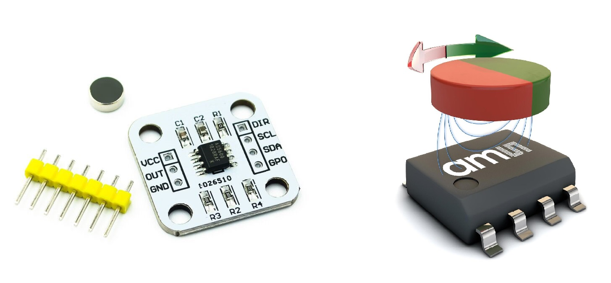

# Sensor angular magnético AS5600

**I2C**

I²C (pronuncia-se “I-squared-C” ou “I-two-C”) é um barramento de comunicação serial que permite que dispositivos mestres enviem e recebam dados de dispositivos escravos. No nosso caso de uso, o mestre seria a placa Arduino e o dispositivo escravo seria um sensor.

_I2C.jpg)

Embora a velocidade de transmissão de dados através do I²C não seja muito rápida (~100 kbits/s), ele ocupa um número muito pequeno de conexões (apenas 2 fios SDA SCL!) para estabelecer uma conexão entre os dispositivos. Além disso, o número de conexões necessárias não aumenta com o aumento do número de dispositivos. Isso torna o I²C um protocolo muito popular em conexões MCU-sensor.

**AS5600**

O AS5600 é um sensor rotativo magnético (sem contacto), programável, de 12 bits e alta resolução. Suporta saída I2C.


O íman foi especialmente concebido e, quando o rodamos sobre o IC (circuito integrado), podemos obter a leitura do sensor no nosso código através do protocolo I2C.


Há varias bibliotecas disponiveis que suportam o AS5600 no arduino.

Usamos aqui a biblioteca 'AS5600' do Rob Tillart. Está disponivel através das bibliotecas do Arduinos. Informação suplementar está disponivel em https://github.com/RobTillaart/AS5600 

**Ligações**

O AS5600 suporta saídas I2C e analógicas. No modo I2C, fornece dados angulares altamente precisos. O modo analógico emite uma tensão proporcional ao ângulo.

Pinout
Pin 	Function
VCC 	Power Supply (3.3V/5V)
GND 	Ground
SDA 	I2C Data Line
SCL 	I2C Clock Line
OUT 	Analog Output 
DIR 	Direction Configuration
MODE 	Output Mode Configuration

Nota: O pino DIR configura a direção de rotação e o pino MODE seleciona entre os modos de saída I2C ou analógica. Para I2C, conecte MODE a GND.

Pin on AS5600 	Pin on Arduino
VCC 	3V3
GND 	GND
SDA 	A4
SCL 	A5
DIR 	GND

Test code
```cpp
#include <Wire.h>
#include <AS5600.h>

AS5600 encoder;

void setup() {
  Serial.begin(9600);
  Wire.begin();

  if (!encoder.begin()) {
    Serial.println("AS5600 not detected. Check connections.");
    while (1);
  }

  Serial.println("AS5600 initialized.");
}

void loop() {
  // Read the current angle in degrees
  float angle = encoder.getAngle();
  Serial.print("Angle: ");
  Serial.print(angle);
  Serial.println(" degrees");

  delay(100); // Update every 100ms
}

```

References:
https://docs.m2stud.io/cs/arduino/i2c/
https://38-3d.co.uk/blogs/blog/how-to-use-the-as5600-magnetic-rotary-encoder-with-arduino

