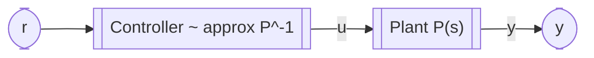

## Sistema / Processo / *Planta*

Em Engenharia de Controlo, um **sistema** é uma abstração de uma porção da realidade física que permite análise e projeto. A essa entidade física controlada chama-se **processo** ou **planta** (*plant*). A planta possui **entradas manipuladas** (sinais que podem ser aplicados, p. ex., tensão num motor ou força num carrinho) e **saídas medidas** (grandezas observáveis, p. ex., velocidade do motor/carrinho ou ângulo num aeropêndulo/pêndulo invertido). A relação dinâmica entre entradas e saídas pode apresentar inércia, atrasos, saturações e não linearidades, e é frequentemente modelada por **funções de transferência** ou **modelos em espaço de estados**, representáveis por equações, diagramas de blocos e respostas temporal/frequencial.

A planta pode estar sujeita a **perturbações** externas (variação de carga, inclinação da pista, correntes de ar, atrito variável), que alteram a saída sem atuação direta. Em síntese, a planta é o objeto físico com **entrada (u)** e **saída (y)** cuja dinâmica se pretende compreender e controlar.

---

## Controlador 

Em Engenharia de Controlo, um **controlador** é o bloco que transforma objetivos de desempenho (referência (r)) em uma **ação de controlo** (u) aplicada à **planta** para obter a **saída** (y) desejada. O controlador pode ser analógico ou digital e é especificado a partir de requisitos como estabilidade, precisão, tempo de resposta e robustez.

---

## Controlo em malha aberta

No **controlo em malha aberta** não existe realimentação da saída durante a operação. A ação (u) é calculada a partir da referência (r) usando um modelo/curva de calibração do sistema. Em termos simples, utiliza-se a **função de transferência inversa** (ou a **calibração inversa** estática) para mapear ($r \mapsto u$), assumindo que a planta se comporta como previsto:
$$u \approx P^{-1}(r) \quad \Rightarrow \quad y \approx r$$
Funciona bem quando a relação entrada-saída é previsível e estável, as perturbações são pequenas e as variações de parâmetros são negligenciáveis.

**Vantagens (malha aberta)**

* Arquitetura simples, implementação e verificação diretas.
* Sem sensores de realimentação: menor custo e latência.
* Ausência de problemas de estabilidade introduzidos pelo controlador (não fecha laço).

**Desvantagens (malha aberta)**

* **Não compensa** perturbações ou variações da planta em tempo real.
* Exige **modelo/calibração precisos**; erros de modelo traduzem-se em erro permanente.
* Sensível a **derivas**, tolerâncias e não linearidades não modeladas.

**Diagrama (malha aberta)**

---

## Controlo em malha fechada

No **controlo em malha fechada** existe **realimentação**: mede-se (y) em tempo real, forma-se o **erro** (e=r-y) e o controlador ajusta (u) continuamente para reduzir esse erro e rejeitar perturbações. O projeto pode ser feito no domínio do tempo (PID, controlo por estados) ou da frequência, tendo em conta estabilidade, margens e desempenho.

**Vantagens (malha fechada)**

* **Rejeição de perturbações** e **acomodação** de variações da planta.
* Redução de **erro em regime**; possibilidade de impor desempenho (tempo de resposta, ultrapassagem).
* Maior **robustez** face a incertezas do modelo.

**Desvantagens (malha fechada)**

* Requer **medição** da saída (sensor), podendo introduzir ruído e custo.
* Necessita **sintonia**; escolhas inadequadas podem degradar desempenho ou causar instabilidade.
* Pode exigir maior capacidade de processamento/latência controlada.

**Diagrama (malha fechada)**

