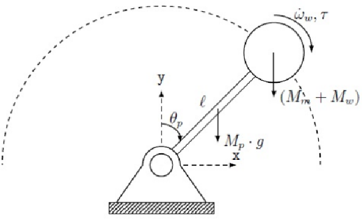

# COIL Project: Inverted Pendulum with Reaction Wheel

This COIL project brings together students from Lisbon Polytechnical University (Portugal) and Amsterdam University of Applied Sciences (Netherlands) in a shared, hands-on learning experience rooted in applied physics and engineering.

## Introduction

Over a four-week period, mixed international student teams will collaborate to **design, simulate, and implement a reaction-wheel inverted pendulum** — a classic control systems challenge with applications in robotics and aerospace.

The goal is to combine theoretical analysis, computational modeling, and practical design, all while engaging in international teamwork and intercultural exchange.

**Learning Objectives**
- Apply principles of classical mechanics, control theory, and embedded systems.  
- Simulate dynamic behavior of the pendulum system using Python.  
- Collaborate across institutions and cultures using online tools.  
- Develop technical, communication, and project management skills.  
- Reflect on engineering practices in a global context.

**What is a COIL?**
**COIL** stands for **Collaborative Online International Learning**. It’s a teaching method that connects courses from different countries through online, project-based collaboration. In a COIL module, two or more instructors co-design and co-teach a shared activity where students work in mixed international teams to complete authentic tasks and reflect on intercultural learning. 

[How to COIL (Collaborative Online International Learning)](https://ureka.eu/how-to-coil-collaborative-online-international-learning-coil/)

**What is a Reaction Wheel Inverted Pendulum?**
A **Reaction Wheel Inverted Pendulum** is a complex mechanical system designed to balance an upright pendulum using a rotating disk (the *reaction wheel*, often being called a **Fly-Wheel**). The goal is to control the wheel's angular momentum to stabilize the pendulum in an upright position.

An **inverted pendulum** is a pendulum balanced in its unstable upright position — like trying to keep a stick standing vertically on your fingertip. It is a classical example of an unstable system that requires active **control** to maintain balance.

**Real-World Examples**
- A **Segway** balancing on two wheels  
- A **rocket** stabilizing itself during launch  
- A **human** standing upright, continuously adjusting posture

In our case, the pendulum starts hanging downward (its stable position) and must first **swing up**, then be **stabilized upright** — even when subjected to unknown disturbances (like small external pushes).

The system uses a **reaction wheel**, rather than a laterally moving base (like in a cart-pendulum): 

- It consists of a **rotating rigid disk or wheel** which is mounted on the pendulums arm.
- The axis of rotation of **reaction wheel** and **pendulum** are **co-linear**. 
- The wheel is driven by **DC motor** which is attached directly, or through a system of gears or pulley and belts.
- According to **Newton’s laws of motion**, a **change** in the wheel’s angular velocity creates a **reaction torque**
- This torque can be used to adjust the angle of the pendulum

Thus, the pendulum can be brought upright and kept balanced using only the internal motion of the wheel.

---

**Why is This Important?**
This is more than a mechanical challenge — it’s a **control engineering problem**.

- The goal is not just to make it work, but to **optimize** it:
  - Minimal energy use
  - Fast stabilization
  - High resilience to noise or disturbances
  
- The system is **nonlinear**, **coupled**, and **unstable by nature**
- It requires a well-designed controller:
  - First a **bang-bang controller** to swing it up  
  - Then a **PID** or **LQR** controller to stabilize it upright  
    - LQR (Linear Quadratic Regulator) is expected to give the best results

As such, the project combines physics, mechanics, electronics, and software with real-world constraints — an ideal platform to learn:

- Dynamics and modeling of unstable systems  
- Sensor and actuator integration  
- Real-time control strategies  
- Simulation vs implementation differences  
- Performance analysis in real-world conditions

It’s a hands-on way to understand **how to design, simulate, build, and control** a dynamic system — a core challenge in modern engineering.


## Collaboration Plan

This project brings together international student teams to model, simulate, implement, and control a Reaction Wheel Inverted Pendulum (RWIP). The goal is to explore both technical and collaborative challenges in control engineering through simulation and physical implementation.

---

**Week 1: Kickoff & Icebreakers**
- Meet your international teammates (via Zoom or Teams).
- Participate in structured icebreaker activities.
- Share backgrounds, expectations, and technical interests.
- Set up collaborative tools: VS Code, Python, GitHub, shared folders.
- Begin reading reference material on inverted pendulums and reaction wheels.

💡 _Tip: Keep a shared team logbook and schedule weekly check-ins._

---

**Week 2: System Understanding & Parameter Assignment**
- Study the inverted pendulum and reaction wheel system.
- Identify key physical and control concepts: torque, moment of inertia, stability.
- Assign unique parameter sets to each team (e.g., pendulum length, mass, motor power, wheel inertia).
- Clarify technical goals and system constraints.
- Start drafting control objectives.

---

**Week 3: Simulation & Strategy Development**
- Build Python simulations of the RWIP system.
- Explore system dynamics (e.g., swing-up vs. stabilization).
- Identify stable and unstable parameter regions.
- Test control strategies:
  - Open-loop behavior
  - Swing-up with **bang-bang control**
  - Stabilization using **PID** and **LQR** controllers
- Compare performance metrics across teams.

---

**Week 4: Physical Implementation & Integration**
- Assemble the RWIP using available materials (e.g., 3D printed parts, hardware components).
- Integrate sensors (e.g., AS5600 magnetic sensor) and actuators (brushed DC motor).
- Wire and interface the system with Arduino or compatible microcontroller.
- Characterize physical properties: friction, inertia, motor constants.
- Validate component specs vs. datasheets.

---

**Week 5: Testing, Comparison & Analysis**
- Deploy controllers on the Arduino (migrating from Python simulations).
- Test swing-up and stabilization phases in real conditions.
- Compare experimental results with simulated predictions.
- Measure performance: response time, overshoot, stability margins.
- Evaluate control effectiveness and hardware limitations.

---

**Final Session: Reflection & Presentation**
- Present each team’s approach, implementation, and results.
- Reflect on the technical, intercultural, and collaborative experiences.
- Share lessons learned and insights into system limitations.
- Discuss real-world relevance and next steps for further development.

**Optional Deliverables**
Each team should maintain:
- Simulation notebooks (.ipynb)
- Arduino code (.ino)
- CAD files (.stl, .step)
- Data logs (.csv)
- Diagrams, images, and demo videos (.png, .mp4)
- -Description of the system and control strategy  
- Simulations and analysis  
- Photographs and diagrams  
- Electrical and mechanical schematics  
- STL files for 3D parts
- Software architecture diagrams  
- Source code (Python and Arduino)
- Description of tests and results  
- Short video of system in action  
- Reflections and conclusions

Include all in your team’s final GitHub repository.

---

🧭 _Remember: Control engineering is not just about making it work — it's about making it optimal, reliable, and tracable._

## Tools

This project combines software-based simulation with hands-on hardware implementation. Below is a list of the essential tools and components you'll be working with, as well as the formats and documentation expected for your final report.

###  Hardware 

- **Mechanical workshop tools and materials**  
  - Use mechanical workshop tools (saw, drill, etc) and materials (wood, bars, tubes, etc.) to manufacture the overall support structure of the system, and to fix the system.  

- **3D Printer and filaments**  
  - Use 3D printing for custom parts such as wheel mounts, pendulum arms, mechanical joints and gears.  

- **Rods, bearings and belts**  
  - Special components that are hard to manufacture to the required precision, like rods, bearings and belts, can be acquired in specialist shops, e.g. for 3d printers or UAVs or sports equipment, or similar. 

- **Cabling, Breadboarding, Wiring & Soldering Equipment**  
  - Needed to build and connect the system reliably.

- **DC Motor (Actuator)**  
  - Drives the reaction wheel. Choose components carefully based on ratings.

- **DC Power supply**  
  - While batteries could do the job, it is highly recommended to use laboratory grade power supplies during development: the power requirements are typically high, and more importantly, a lab grade power supply provides a direct control over the maximum ratings. 
  
- **DC Motor Driver Circuit**  
  - Drives the reaction wheel. Choose components carefully based on ratings.
 
- **(Sensor) AS5600 Magnetic Rotary Sensor**  
  - Precise angle measurement of the pendulum shaft.  
  👉 https://www.ams.com/en/as5600

- **Arduino (Microcontroller)**  
  - Arduino board that runs the real-time control logic. Any UNO grade microcontroller should do. We recommend to use   

- **Multimeter & Osciloscope**  
  - Instruments to analyze and characterize the performance of components and the final system

You must know very well the behavior and limitations of your electrical components:

- **Key Specs to Review**:
  - Supply voltage range
  - Max current and power
  - Sensitivity and accuracy (e.g., of sensors)
- Include this in your **technical dossier**.

---

###  Software

- **[Visual Studio Code (VS Code)](https://code.visualstudio.com/)**  - Main environment for code editing, running Python/Jupyter, and managing Git projects, i.e. tools below can be accessed **directly within VS Code** using extensions.

- **[Python](https://www.python.org/)**  Used for modeling, simulation, and data analysis.

- **[Jupyter Notebooks](https://jupyter.org/)**  - Interactive Python environment combining code, plots, and documentation.

- **[GitHub](https://github.com/)**  - Version control and collaboration platform.

- **[Arduino (Microcontroller + IDE)](https://www.arduino.cc/)**  - The Arduino IDE is used to write and upload `.ino` files.

- **[Onshape](https://www.onshape.com/)** - Cloud-based CAD tool

- **[Ultimaker Cura](https://ultimaker.com/software/ultimaker-cura/)** - Recommended slicer software to prepare `.stl` files for
---

**Data Formats**

| Extension | Description                        | Tool/Use                          |
|-----------|------------------------------------|-----------------------------------|
| `.py`     | Python scripts                     | VS Code, Python                   |
| `.ipynb`  | Jupyter notebooks                  | VS Code (Jupyter), JupyterLab     |
| `.ino`    | Arduino sketches                   | Arduino IDE                       |
| `.stl`    | 3D models for printing             | Fusion 360, Onshape, Cura         |
| `.csv`    | Sensor logs, tabular data          | Python, Excel, Pandas             |
| `.mp4` / `.mp3` | Video/audio demos            | OBS, DaVinci Resolve, Phones      |
| `.jpg` / `.png`| Diagrams, photos              | draw.io, Canva, Snipping Tool     |
| `.pdf`    | Final report and documentation     | Word, LaTeX, Google Docs          |

---


## Technical Overview

A **Reaction Wheel Inverted Pendulum** is a complex mechanical system designed to balance an upright pendulum using a rotating disk (the *reaction wheel*, often being called a **Fly-Wheel**). The goal is to control the wheel's angular momentum to stabilize the pendulum in an upright position.


An **inverted pendulum** is a pendulum balanced in its unstable upright position — like trying to keep a stick standing vertically on your fingertip. It is a classical example of an unstable system that requires active **control** to maintain balance.

**Real-World Examples of inverted pendulum**
- A **Segway** balancing on two wheels  
- A **rocket** stabilizing itself during launch  
- A **human** standing upright, continuously adjusting posture

In our case, the pendulum starts hanging downward (its stable position) and must first **swing up**, then be **stabilized upright** — even when subjected to unknown disturbances (like small external pushes).

The system uses a **reaction wheel**, rather than a laterally moving base (like in a cart-pendulum): 

- It consists of a **rotating rigid disk or wheel** which is attached to the pendulums arm.
- The axis of rotation of **reaction wheel** and **pendulum** are **co-linear**. 
- The wheel is driven by **DC motor** which is attached directly, or through a system of gears or pulley and belts.
- According to **Newton’s laws of motion**, a **change** in the wheel’s angular velocity creates a **reaction torque**
- This torque can be used to adjust the angle of the pendulum

Thus, the pendulum can be brought upright and kept balanced using only the internal motion of the wheel.



**Components**
- **Pendulum**: A rigid arm that pivots at its base and must be balanced vertically.
- **Reaction Wheel**: A rotating mass driven by a motor, mounted on the pendulum. It creates a counteracting torque to stabilize the system.
- **Controller**: Software that measures the system's state (e.g., angle and angular velocity) and determines how to drive the wheel to maintain balance.


## Fundamentals

This section introduces the fundamental concepts and equations behind the Reaction Wheel Inverted Pendulum. It combines physics, electromechanics, and control theory.

---

### Kinematics: Linear vs. Angular Motion

| Quantity      | Linear                         | Angular                         |
|---------------|--------------------------------|----------------------------------|
| Position      | $x$                            | $\theta$                         |
| Velocity      | $v = \frac{dx}{dt}$            | $\omega = \frac{d\theta}{dt}$    |
| Acceleration  | $a = \frac{dv}{dt}$            | $\alpha = \frac{d\omega}{dt}$    |

---

###  Newton’s Laws for Linear Motion
$$ 
F = m a
$$ 

- $F$: Force (N)  
- $m$: Mass (kg)  
- $a$: Acceleration (m/s²)

###  Newton’s Laws for Rotational Motion
$$ 
\tau = I \alpha
$$ 

- $\tau$: Torque (Nm)  
- $I$: Moment of inertia (kg·m²)  
- $\alpha$: Angular acceleration (rad/s²)

To rotate a body with **friction torque** $\tau_f$:

$$ 
\tau_{\text{net}} = I \alpha + \tau_f
$$ 

A spinning disk induces a **reaction torque**:

$$ 
\tau_{\text{reaction}} = -I \alpha
$$ 

Note the correspondence of linear vs angular motion parameters. 


### Moment of Inertia

For a **solid disk** of mass $m$ and radius $r$, rotating about its center:

 $$ 
I = \frac{1}{2} m r^2
 $$ 

For a **solid wheel** (annular disk) of mass $m$, inner radius $R_i$ and outer radius $R_a$:

 $$ 
I = \frac{1}{2} m (R_i^2 + R_a^2)
 $$ 

For a **point mass** $M$ at a distance $L$ from the axis of rotation (e.g., for a pendulum):

 $$ 
I = M L^2
 $$ 

For a **general rotationally symmetric object** with radial mass density $\rho(r)$ (in kg/m):

 $$ 
I = \int_{R_i}^{R_a} \rho(r) \, r^2 \cdot 2\pi r \, dr = 2\pi \int_{R_i}^{R_a} \rho(r) \, r^3 \, dr
 $$ 

For a **composite object** made of multiple components with known moments of inertia $I_1, I_2, \dots, I_n$:

 $$ 
I_{\text{total}} = I_1 + I_2 + \dots + I_n = \sum_{i=1}^n I_i
 $$ 


🔗 [Wikipedia: Moment of Inertia](https://en.wikipedia.org/wiki/Moment_of_inertia)


**Measuring Moment of Inertia in the Lab**

The **moment of inertia** of an object can be determined experimentally using various methods. One simple and effective method is the **torsional pendulum** or **rotational acceleration method**.

**Method 1: Torsional Oscillation**

1. **Suspend** the object from a thin wire or torsion spring, allowing it to rotate freely about a vertical axis.
2. **Measure the period** $T$ of small-angle oscillations.
3. **Determine the torsion constant** $k$ of the wire or system by calibrating with a known inertia or using a reference object.
4. Use the formula:
5. 
    $$ 
   I = \frac{T^2 k}{4\pi^2}
    $$ 

   where:
   - $I$ is the moment of inertia,
   - $T$ is the oscillation period,
   - $k$ is the torsional stiffness.

**Method 2: Angular Acceleration**

1. Apply a **known torque** $\tau$ (e.g., via a hanging mass and pulley).
2. Measure the resulting **angular acceleration** $\alpha$ (using a rotary encoder or sensor).
3. Use Newton's second law for rotation:
   
    $$ 
   I = \frac{\tau}{\alpha}
    $$ 

   - $\tau = r F$, where $F$ is the force applied at radius $r$.

---

### Energy of Rotation and Power conversion

In a rotating system, energy and power are governed by the following key relations.

The **rotational kinetic energy** of a spinning body is:

 $$ 
E_{\text{rot}} = \frac{1}{2} I \omega^2
 $$ 

where:
- $I$ is the moment of inertia (in kg·m²),
- $\omega$ is the angular velocity (in rad/s).

The **mechanical power** delivered to or from a rotating body is:

 $$ 
P_{\text{mech}} = \tau \cdot \omega
 $$ 

where:
- $\tau$ is the torque (in N·m),
- $\omega$ is the angular velocity (in rad/s).

In electromechanical systems (e.g. DC motor + disk), the mechanical power must come from electrical input power. If $\eta$ is the efficiency of conversion:

$$ 
P_{\text{elec}} = \frac{P_{\text{mech}}}{\eta}
$$ 

and

$$ 
P_{\text{elec}} = V \cdot I
$$ 

where:
- $V$ is the supply voltage (in volts),
- $I$ is the current (in amperes),
- $\eta$ is the efficiency (e.g. 0.8 for 80%).

**Numerical Example**

Let’s consider a **solid disk** with:
- mass $m = 1$ kg,
- radius $r = 0.05$ m (10 cm diameter),
- angular velocity $\omega = 2\pi$ rad/s (i.e., 1 turn/s),
- angular acceleration $\alpha = 2\pi$ rad/s²,
- efficiency $\eta = 0.8$.

1. Moment of Inertia of the Disk:

 $$ 
I = \frac{1}{2} m r^2 = \frac{1}{2} \cdot 1 \cdot (0.05)^2 = 0.00125 \ kg·m^2
 $$ 


2. Kinetic Energy of Rotation:

 $$ 
E_{\text{rot}} = \frac{1}{2} I \omega^2 = \frac{1}{2} \cdot 0.00125 \cdot (2\pi)^2 \approx 0.049 \ \text{J}
 $$ 


3. Required Torque:
Assuming angular acceleration $\alpha = 2\pi$ rad/s²:

 $$ 
\tau = I \cdot \alpha = 0.00125 \cdot 2\pi \approx 0.00785 \ N·m
 $$ 


4. Mechanical Power:

 $$ 
P_{\text{mech}} = \tau \cdot \omega = 0.00785 \cdot 2\pi \approx 0.049 \ \text{W}
 $$ 


5. Electrical Power Required:
With 80% efficiency:

 $$ 
P_{\text{elec}} = \frac{P_{\text{mech}}}{\eta} = \frac{0.049}{0.8} \approx 0.061 \ \text{W}
 $$ 


> 🔧 This example highlights the relevance of inertia and torque in system design. Note also that the power levels required to drive mechanical motion are typically beyond what basic microcontrollers can provide, and as such it is required to use a transistor based driver circuit between the Arduino and the Dc motors. 


###  DC Motor Basics

DC motors convert electrical energy into mechanical torque and rotational motion. The fundamental equations are:

- Torque generated: 
-  
   $$ 
  \tau = k_t \cdot I
   $$ 

- Voltage across the motor:  
- 
   $$ 
  V = k_e \cdot \omega + I \cdot R
   $$ 


Where:
- $\tau$: torque (N·m)  
- $I$: current (A)  
- $V$: voltage (V)  
- $\omega$: angular velocity (rad/s)  
- $k_t$: torque constant (N·m/A)  
- $k_e$: back-EMF constant (V·s/rad)  
- $R$: motor coil resistance (Ω)

#### Typical Parameters

To correctly simulate and use a DC motor in a control system, you must know or estimate the following key parameters:

| Symbol      | Quantity                 | Units        | Typical Range (Lab Motors) |
|-------------|--------------------------|--------------|----------------------------|
| $\tau$      | Torque                   | N·m          | 0.01 – 0.2 N·m             |
| $I$         | Current                  | A            | 0.2 – 2 A                  |
| $V$         | Voltage                  | V            | 3 – 24 V                   |
| $\omega$    | Angular speed            | rad/s        | 100 – 2000 rad/s           |
| $k_t$       | Torque constant          | N·m/A        | 0.01 – 0.1 N·m/A           |
| $k_e$       | Back-EMF constant        | V·s/rad      | 0.01 – 0.1 V·s/rad         |
| $R$         | Coil resistance          | Ω            | 0.5 – 10 Ω                 |

---

Most of these values are provided in the motor's datasheet:

- **$k_t$ and $k_e$**: Often given directly. For brushed motors, these are numerically equal ($k_t = k_e$) if using SI units.
- **Stall torque** ($\tau_{\text{stall}}$): Maximum torque at zero speed.
- **No-load speed** ($\omega_{\text{free}}$): Speed at zero torque.
- **Stall current** ($I_{\text{stall}}$): Current at zero speed and maximum torque.
- **Resistance**: $R = V_{\text{stall}} / I_{\text{stall}}$

From these, you can compute:
- $k_t = \tau_{\text{stall}} / I_{\text{stall}}$
- $k_e = V_{\text{free}} / \omega_{\text{free}}$
  
#### Trade-Offs in Motor Selection

The performance of a DC motor is a balance between torque and speed. Key considerations:
- Higher torque → requires more current.
- Higher speed → increases back-EMF and voltage needs.
- Higher current → increases resistive losses ($I^2 R$) and risk of overheating.
- Motor constants ($k_t$, $k_e$) are typically fixed for a given model.

> ⚠️ Always respect **maximum ratings**: exceeding current, voltage, or power may permanently damage the motor.

#### Gears

Gears can be used to **adapt motor output** to desired speed and torque levels.

**Basic Gear Equations**

- Gear ratio:  
- 
   $$ 
  R = \frac{N_{\text{out}}}{N_{\text{in}}}
   $$ 

  where $N$ is the number of teeth or diameter.

- Output torque:  
- 
   $$ 
  \tau_{\text{out}} = R \cdot \tau_{\text{in}}
   $$ 


- Output speed: 
-  
   $$ 
  \omega_{\text{out}} = \frac{\omega_{\text{in}}}{R}
   $$ 


**Why Use Gears?**

- **Increase torque** at the cost of lower speed.
- **Reduce load** on the motor to avoid overheating.
- **Match the dynamics** of the controlled system (e.g. pendulum).

**Pulleys (with belts)** provide similar mechanical advantages as gears.They are quieter than gears, and the distance between shafts is more flexible, so systems with pulleys and belts they are more simple to design and align. At the same time, they are less precise (risk of belt slippage), and limited to moderate torque applications.

**Example: Gear Matching**

Suppose your pendulum needs:
- Torque of $0.1$ N·m
- Speed around $30$ rad/s

But your available motor produces:
- Torque of $0.02$ N·m
- Speed of $150$ rad/s

Then use a gear ratio of:

 $$ 
R = \frac{0.1}{0.02} = 5
 $$ 


This brings output torque up to $0.1$ N·m, and reduces speed to:

 $$ 
\omega_{\text{out}} = \frac{150}{5} = 30 \ \text{rad/s}
 $$ 


---

### Magnetic Position Sensor (AS5600)

- Contactless rotary sensor using a magnetic field.
- Measures absolute angle with high resolution.
- Outputs via I2C or PWM.

🔗 [AS5600 Datasheet](https://ams.com/as5600)

---


### Control Systems

A control system aims to keep the pendulum balanced using feedback.

Main Elements

- **Plant**: The physical system to be controlled (e.g., pendulum)
- **Controller**: Algorithm producing control signals
- **Sensor**: Measures the system state
- **Actuator**: Applies control input (motor)
- **Feedback**: Uses sensor data to adjust behavior

Feedback Control

Continuously reduces error by adjusting inputs based on outputs.

#### Controllers

- **Bang-bang**: All-or-nothing control; fast but unstable.
- **PID**: Combines:
  
 $$ 
  u(t) = K_p e(t) + K_i \int e(t) \, dt + K_d \frac{de(t)}{dt}
 $$   

- **LQR**: Uses optimal gains to minimize cost function:
- 
   $$ 
  u = -Kx
   $$ 

  where $x$ is the system state and $K$ is the gain matrix.


### System Integration with Arduino

Arduino microcontrollers are widely used for real-time control systems due to their simplicity, low cost, and large ecosystem of libraries and tutorials. In this project, the Arduino is responsible for:

- Reading sensor data (e.g., from the AS5600 magnetic rotary sensor)
- Running the control algorithm (Bang-Bang, PID, or LQR)
- Sending the command to the motor driver to actuate the reaction wheel

**Typical Setup Components**

- **Microcontroller**: Arduino Uno / Nano / Mega  
- **Sensor**: AS5600 magnetic rotary position sensor (via I2C)  
- **Actuator**: Brushed DC motor + motor driver (e.g., L298N or TB6612FNG)  
- **Power supply**: Appropriate for motor and controller (check ratings!)  
- **Other**: Wires, resistors, capacitors, breadboards or PCBs  

#### Migrating from Python Simulation to Arduino Deployment

In your development process, you will first simulate the control system (e.g., pendulum dynamics and reaction wheel behavior) using Python. This allows you to:

- Explore different parameters (e.g., control gains, system constants)
- Test various controllers (Bang-Bang, PID, LQR)
- Validate system stability in idealized and perturbed conditions

Once the control strategy is selected and tuned in Python, **you will port the core control logic to C/C++ in the Arduino IDE**:

1. **Isolate the control algorithm** from your Python code (e.g., a function that outputs control action given angle and velocity).
2. **Rewrite this logic in Arduino-compatible C++**, respecting memory and computation constraints.
3. Replace Python’s simulated sensor and motor interfaces with real-time reads from the AS5600 and motor driver control (e.g., `analogWrite()` or `digitalWrite()`).
4. Use Arduino’s `loop()` and `millis()` to structure periodic execution of your control loop (e.g., 100 Hz update rate).
5. Calibrate your sensors and actuators to reflect real-world behavior.

> ⚠️ Real hardware behaves differently than simulations — expect to tune your controller gains again!

By mirroring your software architecture between simulation and deployment, you ensure a smoother transition and better reuse of your logic.


---
```cpp
#include <Wire.h>
#include <AS5600.h>

// === Sensor Setup ===
AMS_5600 encoder;

// === Motor Pins ===
const int pwmPin = 9;     // PWM signal to motor
const int dirPin1 = 7;    // Motor direction
const int dirPin2 = 8;

float targetAngle = 180.0;   // Upright position in degrees
float currentAngle = 0.0;

// === PID Parameters ===
float kp = 1.5;
float ki = 0.1;
float kd = 0.05;

float error = 0;
float previousError = 0;
float integral = 0;

unsigned long lastTime = 0;
float dt = 0;

// === Motor Control Function ===
void setMotor(float pwmValue) {
  pwmValue = constrain(pwmValue, -255, 255);

  if (pwmValue > 0) {
    digitalWrite(dirPin1, HIGH);
    digitalWrite(dirPin2, LOW);
    analogWrite(pwmPin, pwmValue);
  } else {
    digitalWrite(dirPin1, LOW);
    digitalWrite(dirPin2, HIGH);
    analogWrite(pwmPin, -pwmValue);
  }
}

// === Get Angle in Degrees ===
float getAngleDeg() {
  int rawAngle = encoder.getRawAngle(); // 0–4095
  float angle = (rawAngle / 4095.0) * 360.0;
  return angle;
}

void setup() {
  Serial.begin(9600);
  Wire.begin();

  pinMode(pwmPin, OUTPUT);
  pinMode(dirPin1, OUTPUT);
  pinMode(dirPin2, OUTPUT);

  delay(500); // Allow sensor startup
  Serial.println("PID Control Initialized");
  lastTime = millis();
}

void loop() {
  unsigned long currentTime = millis();
  dt = (currentTime - lastTime) / 1000.0;
  lastTime = currentTime;

  currentAngle = getAngleDeg();
  error = targetAngle - currentAngle;

  integral += error * dt;
  float derivative = (error - previousError) / dt;

  float output = kp * error + ki * integral + kd * derivative;
  setMotor(output);

  previousError = error;

  // Debug info
  Serial.print("Angle: ");
  Serial.print(currentAngle);
  Serial.print(" | Output: ");
  Serial.println(output);

  delay(10); // ~100 Hz loop
}

```


## Architectures


## Modelling

The simulation involves modeling the dynamics of a Reaction Wheel Inverted Pendulum (RWIP) system. The key components include:

***Reaction Wheel Inverted Pendulum Dynamics***

<br>


RWIP Parameter
- `L1` - Pendulum length from orgin to center of mass
- `L2` - Pendulum length
- `m1` - Mass of pendulum
- `m2` - Mass of fly wheel
- `θp` - Angle of pendulum
- `θr` - Angle of fly wheel
- `I1` - Innertia moment of pendulum
- `I2` - Innertia moment fly wheel and Innertia moment of motor
- `g` - Gravitational acceleration
- `Tm` - Torque apply by DC motor
- `Td` - Disturbance

Kinetic Energy

&emsp; $K = \frac{1}{2}(m_{1}L_{1}^{2}+m_{2}L_{2}^{2}+I_{1})\dot{θ_p}^{2} + \frac{1}{2}I_{2}(\dot{θ_p}+\dot{θ_r})^{2}$

&emsp; $K = \frac{1}{2}(m_{1}L_{1}^{2}+m_{2}L_{2}^{2}+I_{1}+I_{2})\dot{θ_p}^{2} + I_{2}\dot{θ_p}\dot{θ_r} + \frac{1}{2}I_{2}\dot{θ_r}^{2}$

Potential Energy

&emsp; $V = (m_1L + m_2L)g\cosθ_p$


Lagrange Method

&emsp; $\frac{d}{dt} \left( \frac{\partial L}{\partial \dot{θ_r}} \right) - \frac{\partial L}{\partial θ_r} = 0$
&emsp;&emsp; and

&emsp; $\frac{d}{dt} \left( \frac{\partial L}{\partial \dot{θ_p}} \right) - \frac{\partial L}{\partial θ_p} = T_m$

&emsp; Where Lagrangian (L) is

&emsp; $L = K - V$


Mathematical equations of RWIP is described as

&emsp; $\ddot{\theta_p} = \frac{m_{1}gL_{1}\sin\left(\theta_{p}\right)\ +\ m_{2}gL_{2}\sin\left(\theta_{p}\right)\ -\ T_{m} +\ T_{d}}{m_{1}L_{1}^{2}+m_{2}L_{2}+I_{1}}$

<br>

&emsp; $\ddot{\theta_r} = \frac{T_{r}}{I_{2}}\-\frac{m_{1}gL_{1}\ +\ m_{2}gL_{2}\ -\ T_{m} +\ T_{d}}{m_{1}L_{1}^{2}+m_{2}L_{2}+I_{1}}$

<br>

***DC Motor Dynamics***


<br>

Brushed DC Motor Parameter

- `Vin` - Input Voltage
- `R` - Motor resistance
- `L` - Motor inductance
- `i` - Motor current
- `B` - Motor damped
- `J` - Motor rotor Innertia
- `ke` - Back EMF constant
- `kt` - Torque constant

Electrical part

&emsp; $Vin = R i + L \frac{di}{dt} + k_e θ_r$

Mechanical Part

&emsp; $T_{m} = Bθ_r + J\frac{\dot{θ_r}}{dt}$

&emsp; $T_{m} = k_t i$
<br>

### Controllers

- **LQR Controller**: A linear quadratic regulator designed to stabilize the pendulum in the upright position.

    
    #### Linearization dynamics model ####
  
    - **Part RWIP**
 
      when sinθp -> 0 sinθp = θp
  
    &emsp;&emsp;&emsp; $\ddot{\theta_p} = \frac{m_{1}gL_{1}\theta_{p}\ +\ m_{2}gL_{2}\theta_{p}\ -\ T_{m} +\ T_{d}}{m_{1}L_{1}^{2}+m_{2}L_{2}+I_{1}}$

    &emsp;&emsp;&emsp; $\ddot{\theta_r} = \frac{T_{m}}{I_{2}}\-\frac{m_{1}gL_{1}\ +\ m_{2}gL_{2}\ -\ T_{m} +\ T_{d}}{m_{1}L_{1}^{2}+m_{2}L_{2}+I_{1}}$
  
    - **Part Motor**

    &nbsp;&nbsp;&nbsp;We can estimate that L << R
        
    &emsp;&emsp;&emsp; $Vin = R i + k_e θ_r$

    &emsp;&emsp;&emsp; $T_{m} = k_t i$

    #### State space ####
  
  The proceeding equations are valid around the operating point where θp = 0
  
&emsp;&emsp;&emsp;&emsp;&emsp;
g%7D%7Bm_1L_1%5E%7B2%7D&plus;m_2L_2%5E%7B2%7D&plus;J%7D&0&0&%5Cfrac%7Bk_tk_e%7D%7B(m_1L_1%5E%7B2%7D&plus;m_2L_2%5E%7B2%7D&plus;J)R%7D%5C%5C0&0&0&1%5C%5C-%5Cfrac%7B(m_1L_1&plus;m_2L_2)g%7D%7Bm_1L_1%5E%7B2%7D&plus;m_2L_2%5E%7B2%7D&plus;J%7D&0&0&-(%5Cfrac%7Bm_1L_1%5E%7B2%7D&plus;m_2L_2%5E%7B2%7D&plus;2J%7D%7B(m_1L_1%5E%7B2%7D&plus;m_2L_2%5E%7B2%7D&plus;J)J%7D)(%5Cfrac%7Bk_tk_e%7D%7BR%7D)%5C%5C%5Cend%7Bbmatrix%7D%5Cbegin%7Bbmatrix%7D%5Ctheta_p%5C%5C%5Cdot%7B%5Ctheta_p%7D%5C%5C%5Ctheta_r%5C%5C%5Cdot%7B%5Ctheta_r%7D%5Cend%7Bbmatrix%7D&plus;%5Cbegin%7Bbmatrix%7D0%5C%5C%5Cfrac%7Bk_t%7D%7B(m_1L_1%5E%7B2%7D&plus;m_2L_2%5E%7B2%7D&plus;J)R%7D%5C%5C0%5C%5C(%5Cfrac%7Bm_1L_1%5E%7B2%7D&plus;m_2L_2%5E%7B2%7D&plus;2J%7D%7B(m_1L_1%5E%7B2%7D&plus;m_2L_2%5E%7B2%7D&plus;J)J%7D)(%5Cfrac%7Bkt%7D%7BR%7D)%5Cend%7Bbmatrix%7DV_%7Bin%7D)

 - **PID Controller**:
     The stabilize controller to compare with LQR
    #### Transfer function ####
   
    &emsp;&emsp;&emsp; $\Large\frac{\theta_{p}(s)}{\tau_{m}(s)}=\frac{\frac{s}{-J-m_{2}L_{2}^{2}}}{s^{3}+\left(\frac{B}{I_{1}}+\frac{B+d_{p}}{J+m_{2}L_{2}^{2}}\right)s^{2}-\left(\frac{\left(m_{1}L_{1}+m_{2}L_{2}\right)g}{\left(J+m_{2}L_{2}^{2}\right)I_{1}}-\frac{B\cdot d_{p}}{\left(J+m_{2}L_{2}^{2}\right)I_{1}}\right)s-\frac{\left(m_{1}L_{1}+m_{2}L_{2}\right)Bg}{\left(J+m_{2}L_{2}^{2}\right)I_{1}}}$

   #### Root Locus Design ####
   
     To predict the system's characteristics as the gain (Kp) is adjusted and poles move, design the root locus.
      
     &emsp;&emsp;&emsp; 

     Root Locus of the system by default parameter set. It has one zero (s = 0), and three poles (s = -74.93; s =-3.88e-3; s = 73.53).

   #### Closed Loop Root Locus ####
   
   &emsp;&emsp;&emsp; 
   
   &emsp; Where G(s) is Kp the gain can be adjusted ti make the closed loop poles to be in stable location The resultant Root Locus can be seen below (note to plot this graph in  `param.py` you need to set ` Stabilize_Controller ` to "PID" mode and set ` plot_rootlocus ` to "True") in this graph you can click pole position you want to know Gain `Kp` to adjust your system characteristics. 
   
   &emsp;&emsp;&emsp;

- **Bang-bang Controller**: 
The swing up control routine and the stabilizing control routine are switched between -25 to 25 degree

&nbsp;&nbsp; 

- **Brake Controller**: Used as reduced energy of RWIP when RWIP have too much energy for stabilze


## Simulation

This project simulates the dynamics of a Reaction Wheel Inverted Pendulum and includes controllers such as LQR and a Bang-bang controller.

### Getting Started

### Prerequisites

Ensure you have the following dependencies installed:

- `numpy`
- `pygame`
- `matplotlib`
- `PyQt5`
- `pygetwindow`
- `pyaudio`
- `threading`
- `control` (install via `pip install control`)

### Installation

Clone the repository and install the dependencies:

```bash
git clone https://github.com/B-Paweekorn/Reaction-wheel-inverted-pendulum.git
cd Reaction-wheel-inverted-pendulum
pip install -r requirements.txt
```

<br>

### Usage


**Inject** - Type the amount of torque into the box and click `INJECT` or ENTER key to inject a disturbance to the system

**Reset** - Click `RESET` to reset the system

**Plotting** - Click on the pendulum plot or the plot window to plot the data

Edit the parameters in ```param.py```

<br>


### Sound Generation

&nbsp;&nbsp;&nbsp;&nbsp;&nbsp;&nbsp;&nbsp; The simulation incorporates sound generation related to the speed of the reaction wheel. This feature adds an auditory element to the simulation, enhancing the user experience.

<br>

## Compare PID controller and LQR controller
In this project, we explore and compare the performance of two different control strategies: PID (Proportional-Integral-Derivative) controller and LQR (Linear Quadratic Regulator) controller.
<br>


***Linear quadratic regulator***
<br>


| Error (deg)    | settling time (s) | Power (Watt) |
| ---      | ---       | --- |
| 5 |  0.66     | 0.6|
| 6 |  0.73|     1.01   |
| 7 |  0.85|1.75|
| 8 |  1.07|        3.5|
| 9 |  can't stabilize | can't stabilize |

Max Disturbance : **9.32 Nm**

***PID :*** Kp = 500 (choose form root locus)
| Error (deg)    | settling time (s) | Power (Watt) |
| ---      | ---       | --- |
| 5 |  20.43| 10.06|
| 6 |  21.02| 12.17 |
| 7 |  21.37| 13.95 |
| 8 |  21.59| 15.96 |
| 9 |  can't stabilize | can't stabilize |

Max Disturbance : **8.05 Nm**

***PID :*** Kp = 215800 (choose form root locus)

***Notice*** that when choose unstable pole the system still stable because now it have **hardware limit** so the character of controller same like Fuzzy logic control to see unstable you need to unlock hardware limitation by set ` MotorLimit ` to **False** in ` param.py `

### Conclusion

|    | Stabilize boundary |
| ---      | ---       | 
| **LQR** |  Can stabilize in every position  |
| **PID** |  Can stabilize only in small boundary| 

**PID Controller**
  The PID controller is a widely used feedback control system that relies on three components: Proportional, Integral, and Derivative. Here's a brief overview of each component:
  
  - Proportional (P): Reacts to the current error.
  - Integral (I): Reacts to the accumulation of past errors.
  - Derivative (D): Predicts future errors based on the rate of change.

  **Advantages of PID:**
  - Simplicity and ease of implementation.
  - Effectiveness in a wide range of systems.
  - Intuitive tuning parameters for performance optimization.
  
  **Considerations:**
  - Tuning may be required for optimal performance in different systems.
  - Limited capability to handle complex or nonlinear systems.
<br>

  **LQR Controller**
  The LQR controller is designed based on the principles of optimal control theory. It minimizes a cost function that combines both state and control input, making it suitable for linear, time-invariant systems.

**Advantages of LQR:**
- Optimal control solution for linear systems.
- Ability to handle systems with multiple inputs and outputs.
- Incorporates a mathematical model for optimal performance.

**Considerations:**
- Requires a good understanding of the system dynamics for effective modeling.
- Limited applicability to strictly linear systems.


## Implementation

## Analysis

## Reference

- [Swing Up and Balancing of a Reaction Wheel Inverted Pendulum](http://ise.ait.ac.th/wp-content/uploads/sites/57/2020/12/Swing-Up-and-Balancing-of-a-Reaction-Wheel-Inverted-Pendulum.pdf)

- [Inverted Pendulum: State-Space Methods for Controller Design](https://ctms.engin.umich.edu/CTMS/index.php?example=InvertedPendulum&section=ControlStateSpace)
